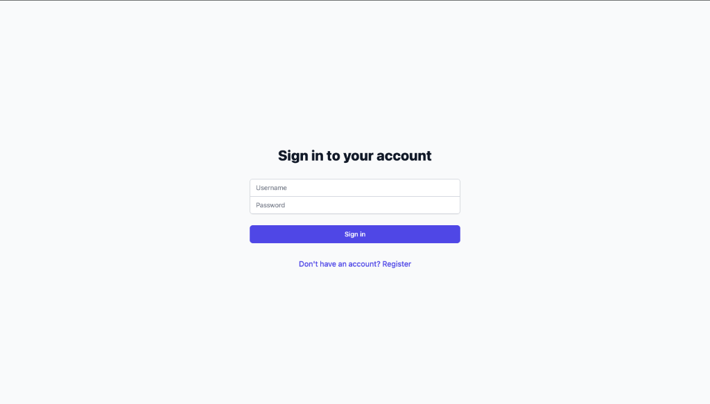
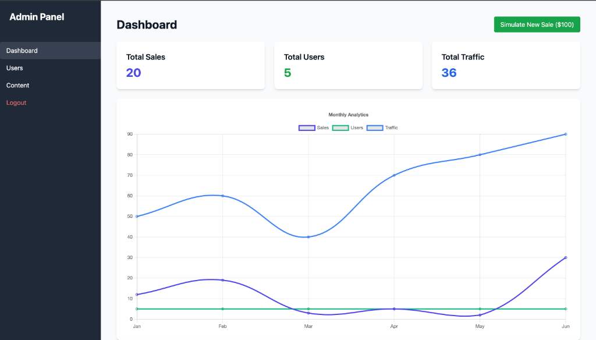
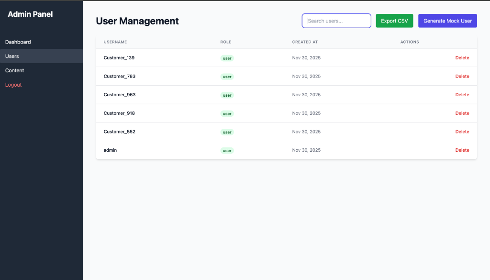
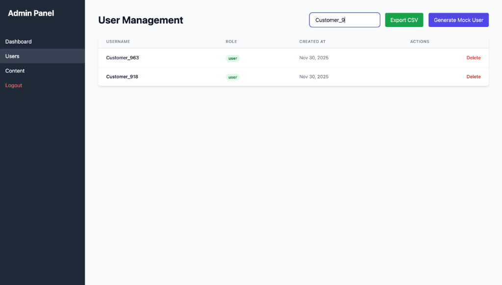
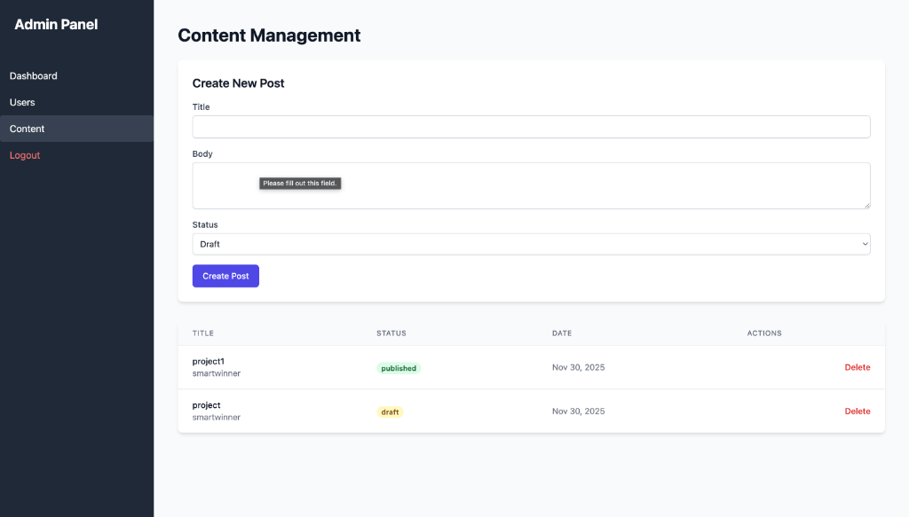

# 🚀 MEAN Stack Admin Dashboard

> A production-ready, real-time Admin Dashboard built with the MEAN stack (MongoDB, Express, Angular, Node.js).

## 🌟 Key Features (Why this project stands out)

-   **⚡ Real-Time Analytics**: Live data updates using **Socket.io**. Watch charts update instantly without refreshing.
-   **🔍 Advanced Search & Export**: Filter users instantly and export data to CSV for reporting.
-   **☁️ Cloud Database**: Connected to **MongoDB Atlas** for production-grade data persistence.
-   **🛡️ Enterprise-Grade Security**: Protected with **Helmet** (Secure Headers) and **Rate Limiting** to prevent abuse.
-   **📱 Premium UI/UX**: Fully responsive design powered by **Tailwind CSS** with professional loading states.
-   **📝 Content Management**: Full CRUD capabilities for managing platform content, not just users.
-   **🧠 Smart DB Connection**: Automatically falls back to an **In-Memory MongoDB** if a local instance is missing. Runs anywhere, instantly.

## 🛠️ Tech Stack

-   **Frontend**: Angular 19, Tailwind CSS, Chart.js, Socket.io-client
-   **Backend**: Node.js, Express, Mongoose, Socket.io, JSON Web Token (JWT)
-   **Security**: Bcrypt, Helmet, Express-Rate-Limit
-   **Database**: MongoDB (with `mongodb-memory-server` fallback)

## 🚀 Getting Started

### Prerequisites & Version Details
-   **Node.js**: v18.17.0 or higher (Tested on v20.10.0)
-   **NPM**: v9.0.0 or higher
-   **Angular CLI**: v19.0.0
-   **MongoDB**: v6.0+ (Optional: Project includes In-Memory fallback)

### Installation

1.  **Clone the repository**

    git clone <repo-url>
    cd mean-admin-dashboard

2.  **Setup Backend**
    cd server
    npm install
    # Start the server (Runs on port 3000)
    node index.js

    *Note: The server will automatically use an in-memory database if no local MongoDB is found.*

3.  **Setup Frontend**
    cd client
    npm install
    # Start the Angular app (Runs on port 4200)
    npm start
    

4.  **Access the App**
    Open `http://localhost:4200` in your browser.

## 🧪 Testing the Features

1.  **Register/Login**: Create an admin account.
2.  **Real-Time Dashboard**: Open the dashboard in two windows. Updates in one reflect in the other.
3.  **Content Manager**: Navigate to "Content" to create/publish posts.

## 📸 Project Gallery

### 1. Login Page
A clean, professional login interface secured with JWT authentication.

### 2. Dashboard
The heart of the application. Displays live metrics for Sales, Users, and Traffic with simulate new sales feature.

### 3. User Management
A comprehensive list of all registered users. Admins can view details and manage roles.

### 4. User Management with Search Feature
Real-time filtering capability showing the search functionality in action.

### 5. Content Management
A dedicated interface for creating and managing platform content.

## 📂 Project Structure

mean-admin-dashboard/
├── client/                 # Angular Frontend
│   ├── src/app/
│   │   ├── components/     # UI Components (Dashboard, Content, etc.)
│   │   ├── services/       # API & Socket Services
│   │   ├── guards/         # Auth Guards
│   │   └── interceptors/   # Loading Interceptor
├── server/                 # Node.js Backend
│   ├── models/             # Mongoose Schemas
│   ├── routes/             # API Endpoints
│   ├── middleware/         # Error & Security Middleware
│   └── index.js            # Entry Point

---
**Author**: Hari Nagi Reddy Katta

